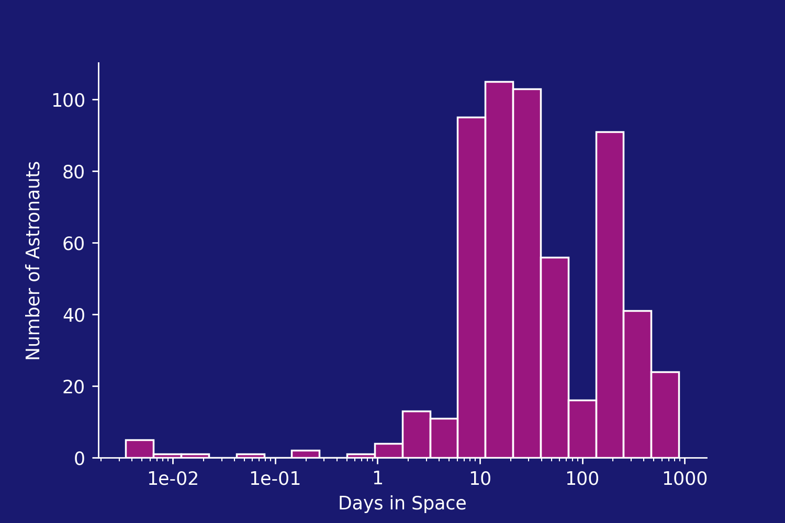

# Astronaut Database

 

This repository explores how Python can be used to download and analyse the <a href="https://www.supercluster.com/astronauts">astronauts database</a> created by supercluster.

 

### Analysis

